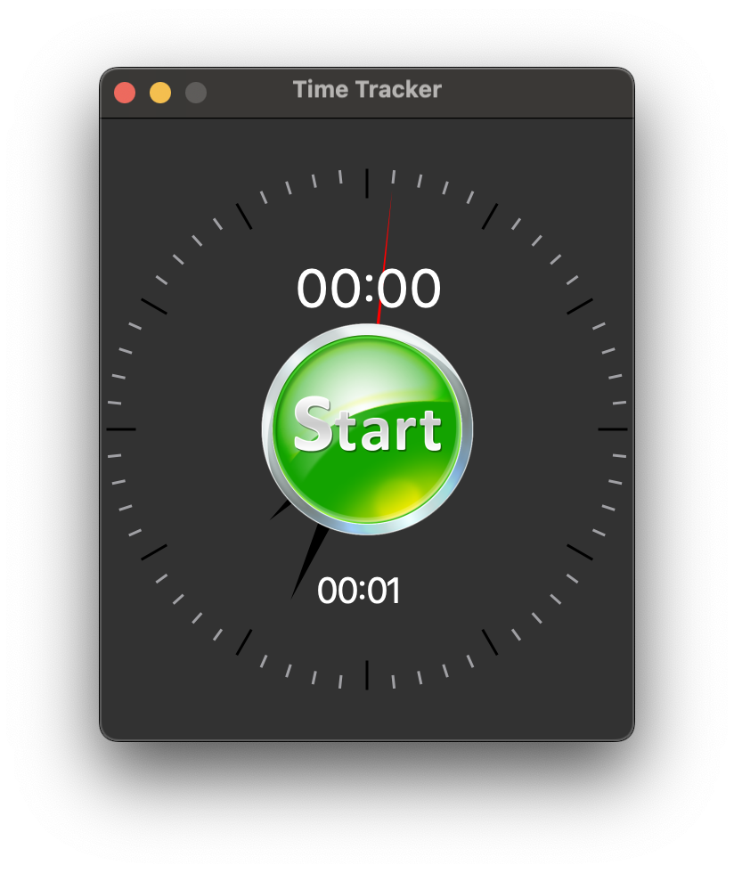
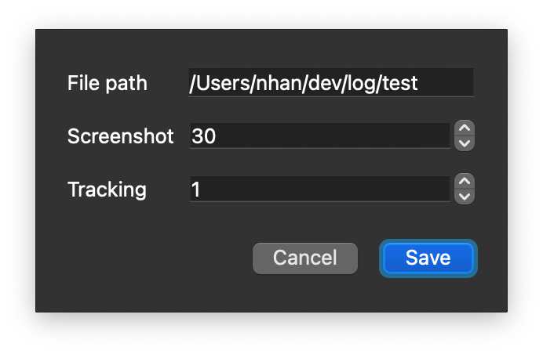
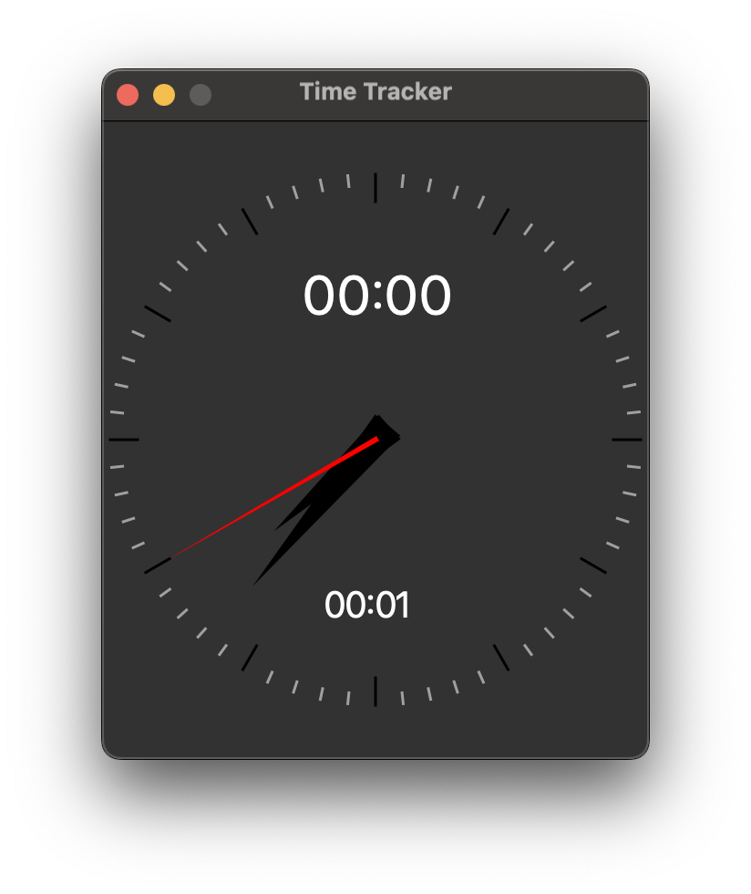
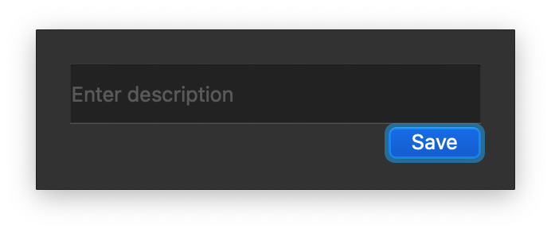

This is a very simple Qt desktop application for time tracking.

# Features
## Start-up
- `00:00` is current working time
- `00:01` is total previous working time


## Settings
Default settings are
- Logging working time every `1` minutes
- Capture screenshot every `30` minutes
- Save log and screenshot to `File Path`


## Start and end working session
- Click `Start` to start working session

- `Command + S` to stop working session => give a name for the session



# Development
## Create conda environment
```bash
conda create -n tracker python=3.10
conda activate tracker

pip install -r requirements.txt
python main.py
```

## Standalone application
https://www.pythonguis.com/tutorials/packaging-pyqt5-applications-pyinstaller-macos-dmg/
```bash
pip install PyInstaller

pyinstaller -n "TimeTracker" --add-data "assets:assets" --windowed main.py

# => search spotlight for `TimeTracker`
```


https://www.pythonguis.com/tutorials/packaging-pyqt5-applications-linux-pyinstaller/
```bash
# Ubuntu
sudo apt install ruby
export PATH=/home/nhan/.local/share/gem/ruby/3.1.0/bin:$PATH
gem install fpm --user-install

bash build-linux.sh

fpm -C package -s dir -t deb -n "TimeTracker" -v 0.1.0 -p TimeTracker.deb
sudo dpkg -i TimeTracker.deb
```
