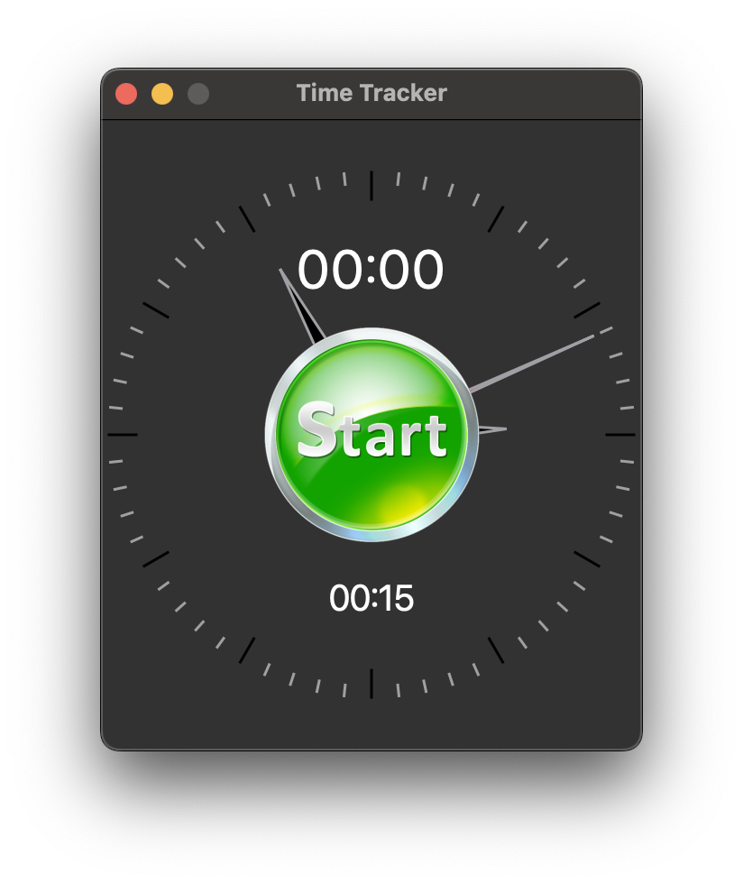

This is a very simple Qt desktop application for time tracking.



## Qt Installation
- Download pre-built Qt from https://www.qt.io/download-open-source and install in `$HOME/Qt`
- Build from source:
    - Download from https://download.qt.io/archive/qt/
    - Install in `$HOME/mQt`
    ```bash
    wget https://download.qt.io/archive/qt/6.8/6.8.0/single/qt-everywhere-src-6.8.0.tar.xz
    tar xvf qt-everywhere-src-6.8.0.tar.xz
    mkdir -p $HOME/mQt qt-everywhere-src-6.8.0/build && cd qt-everywhere-src-6.8.0/build
    ../configure -release -shared -prefix $HOME/mQt -- -DCMAKE_OSX_ARCHITECTURES=arm64
    cmake --build . --parallel
    cmake --install .
    ```

## Development
### macOS
```bash
# Pre-built Qt on macOS
cmake -S . -B build -DCMAKE_PREFIX_PATH=$HOME/Qt/6.8.0/macos -DCMAKE_OSX_ARCHITECTURES=arm64 -DCMAKE_BUILD_TYPE=Release
# Or build from source (shared)
cmake -S . -B build -DCMAKE_PREFIX_PATH=$HOME/mQt -DCMAKE_OSX_ARCHITECTURES=arm64 -DCMAKE_BUILD_TYPE=Release

# Compile
cmake --build build --config Release --parallel

# Package
~/mQt/bin/macdeployqt build/TimeTracker.app -verbose=3 -dmg
```

### Linux
```bash
# Build from source (static)
../configure -release -static -prefix $HOME/mQt
cmake --build . --parallel
cmake --install .

# Compile and Package
bash linux-package.sh
```